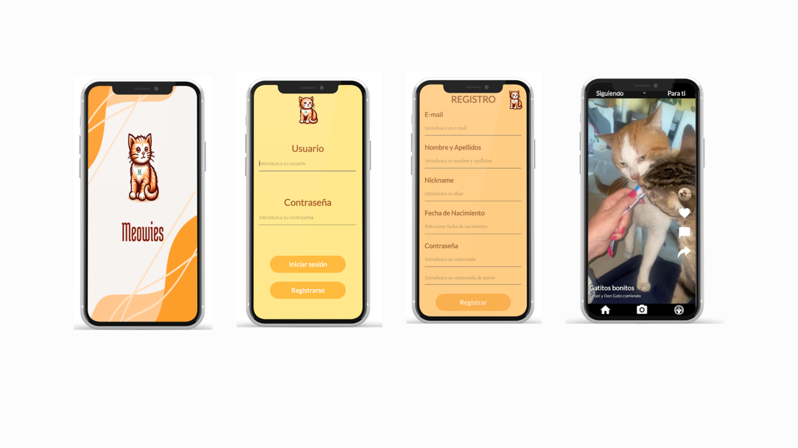
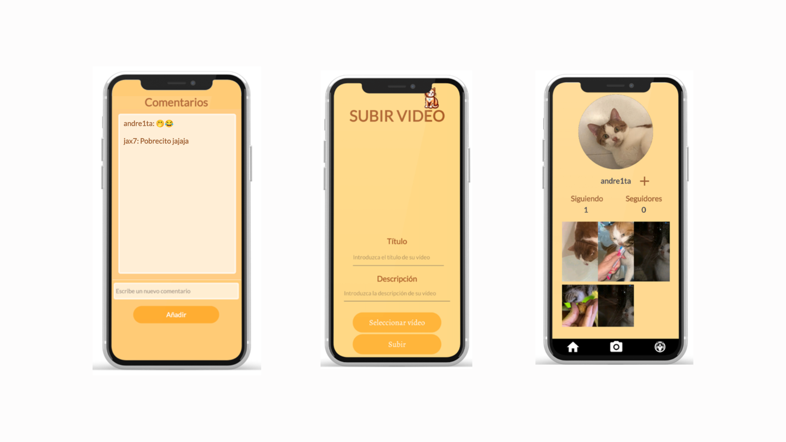

# Meowies

Meowies es una aplicación móvil, disponible para Android, que busca satisfacer las necesidades de aquellos usuarios que desean ver un contenido específico, vídeos de gatos.
La aplicación permite la subida de vídeos con su título y descripción, la posibilidad de seguir a otros usuarios, dar me gusta y comentar en los posts tanto personales como de otros usuarios.

**Esta aplicación fue desarrollada como Trabajo de Fin de Curso del Grado Superior de Desarrollo de Aplicaciones Multiplataforma.**

## Tecnologías utilizadas

**Android Studio:** Elegí esta plataforma porque mi objetivo era desarrollar una aplicación móvil para Android, y Android Studio ofrece herramientas avanzadas que fueron cruciales para el desarrollo eficiente. Utilicé su editor de código, diseñador de interfaces intuitivo y emuladores de dispositivos Android para agilizar el proceso de desarrollo y asegurar la compatibilidad con una amplia gama de dispositivos. 

**Java:** Elegí Java como el lenguaje principal para desarrollar Meowies debido a mi amplio conocimiento y experiencia en su uso. Además, su amplia comunidad y documentación accesible facilitaron la resolución de problemas y la implementación de las mejores prácticas en el desarrollo de la aplicación Meowies. 

**Firebase:** Integré Firebase en Meowies para aprovechar Firebase Storage, que me permitía el almacenamiento seguro y eficiente de archivos multimedia como imágenes y videos. Además, Firestore Database me permitió la gestión de datos en tiempo real de manera escalable y organizada. Esto fue crucial para mantener la sincronización en tiempo real entre usuarios y publicaciones, mejorando la experiencia de usuario y la eficiencia operativa de la aplicación.
